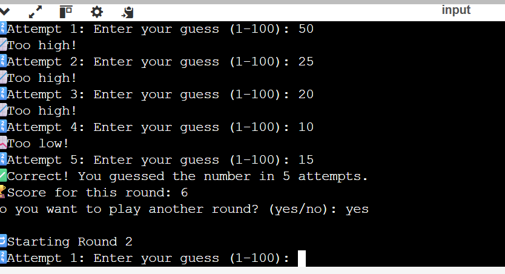

🎮 Number Guessing Game
A simple console-based Number Guessing Game built in Java. The player tries to guess a randomly generated number between 1 and 100 within a limited number of attempts.

📋 Features
Random number generation each round (1 to 100)

User has up to 7 attempts to guess the number

Feedback after each guess:

🔼 Too high

🔽 Too low

Score calculated based on number of attempts

Play multiple rounds with cumulative scoring

Interactive console experience

🚀 How to Run
Prerequisites
Java JDK installed (version 8 or higher)

Any IDE or terminal

Steps
Save the code in a file named Main.java

Open terminal/command prompt and navigate to the directory

Compile the code:

javac Main.java
Run the program:
java Main
🧮 Scoring System
Maximum score per round: 10

For each additional attempt used, score decreases by 1

If the number isn't guessed in 7 attempts, score for that round is 0

📝 Sample Output
🎮 Welcome to the Number Guessing Game!

🔁 Starting Round 1
🔢 Attempt 1: Enter your guess (1-100): 50
📉 Too low!
...
✅ Correct! You guessed the number in 3 attempts.
🏆 Score for this round: 8
Do you want to play another round? (yes/no): no

🎉 Game Over!
Total Rounds Played: 1
Total Score: 8
📦 Technologies Used
Language: Java

Libraries: java.util.Scanner, java.util.Random

 

Task2:
# Student Marks & Grade Calculator

A simple Java console application that reads a variable number of subject marks, validates them, computes total marks, average percentage, and assigns a letter grade.

---

## 📋 Table of Contents

1. [Features](#features)  
2. [Prerequisites](#prerequisites)  
3. [Getting Started](#getting-started)  
   - [Clone the Repo](#clone-the-repo)  
   - [Compile](#compile)  
   - [Run](#run)  
4. [Usage](#usage)  
5. [Sample I/O](#sample-io)  
6. [Project Structure](#project-structure)  
7. [Contributing](#contributing)  
8. [License](#license)  

---

## 🔍 Features

- Prompt user for **number of subjects**  
- Input validation (marks between 0–100)  
- Calculates:
  - Total marks  
  - Average percentage  
  - Letter grade (A–F)  
- Modular code with reusable methods  

---

## 🛠 Prerequisites

- **Java 8** or higher  
- A terminal/command‑line environment  

---

## 🚀 Getting Started

### Clone the Repo

java Main
🎯 Usage
Enter the number of subjects when prompted.

Input each subject’s marks (0–100).

View the calculated total, average percentage, and letter grade.
💡 Sample I/O
Enter the number of subjects: 4
Enter marks for Subject 1: 85
Enter marks for Subject 2: 92
Enter marks for Subject 3: 76
Enter marks for Subject 4: 68

--- Result ---
Total Marks: 321
Average Percentage: 80.25%
Grade: B

🧰 Technologies Used
Java – Core language used for logic and console interaction

JDK (Java Development Kit) – Required to compile and run the application

Scanner Class – For user input handling

Modular Functions – For clean, structured, and reusable code

Command Line Interface (CLI) – No GUI, runs directly in the terminal
 
